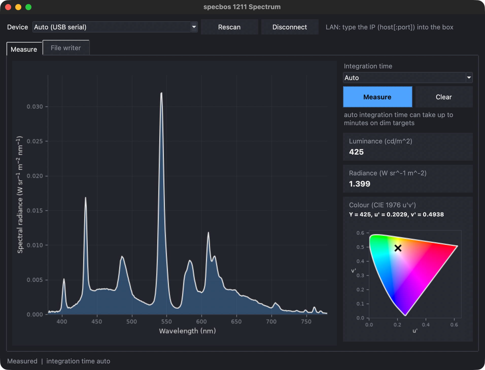

# PySpecbos1211

Pure-Python driver for the **JETI specbos 1211** spectroradiometer. Works on
macOS (Apple Silicon and Intel) via USB serial or TCP/LAN — no Windows SDK
required.

The JETI SDK ships Windows-only DLLs (`jeti_core.dll`, `jeti_radio_ex.dll`).
This driver bypasses it entirely and speaks the device's own SCPI-compatible
text protocol directly over the serial port or a TCP socket.

VIBECODE ALERT. But it was tested with a Jeti specbos 1211-LAN :)

---

## Requirements

- Python 3.10+
- [pyserial](https://pypi.org/project/pyserial/) >= 3.5
- [numpy](https://pypi.org/project/numpy/) >= 1.20

No other dependencies. The entire driver is a single file: `specbos1211.py`.

The optional GUI (`specbos1211_gui.py`) additionally needs matplotlib,
colour-science and scipy; Tk comes with Python.

---

## Installation

Clone or copy `specbos1211.py` into your project, then install the two
dependencies:

```bash
pip install pyserial numpy
```

Or with a virtual environment:

```bash
python -m venv .venv
source .venv/bin/activate
pip install pyserial numpy
```

---

## Hardware connection

### USB (standard model)

The specbos 1211 contains an FTDI FT232R USB-to-serial chip. On macOS the
built-in `AppleUSBFTDI` kernel extension (present since macOS 10.9) creates a
virtual serial port automatically when the device is plugged in. No driver
installation is required.

The port appears as `/dev/cu.usbserial-XXXXXXXX` (use `cu.*`, not `tty.*`,
with pyserial to avoid blocking open).

Serial settings used by this driver:

| Parameter  | Value     |
|------------|-----------|
| Baud rate  | 921600 (default; also 38400 or 115200) |
| Data bits  | 8         |
| Parity     | None      |
| Stop bits  | 1         |
| Flow ctrl  | None      |

To find the port manually:

```bash
python -c "from serial.tools import list_ports; print([p.device for p in list_ports.comports()])"
```

### TCP/LAN (LAN variant)

The LAN variant uses a Digi Connect ME ethernet module that bridges the
internal serial port to the network. Connect to the device's IP address on
TCP port 2101. The firmware protocol is byte-for-byte identical to USB.

The IP address is assigned via DHCP by default. Use the Digi Device Discovery
tool (Windows) to assign a static IP if needed.

---

## Quick start

```python
from specbos1211 import Specbos1211, JetiError

# Auto-detect the USB port and measure spectral radiance
with Specbos1211.from_serial() as dev:
    dev.configure(wbeg=380, wend=780, step=1)
    wl  = dev.wavelengths       # shape (401,) in nm
    spd = dev.measure('sprad')  # shape (401,) in W sr^-1 m^-2 nm^-1
    print(f"peak: {spd.max():.3e} W sr^-1 m^-2 nm^-1 @ {wl[spd.argmax()]:.0f} nm")
```

---

## GUI



`python specbos1211_gui.py` (or `python -m specbos1211_gui`) is a minimal
spectral viewer for getting a measurement without writing code:

```bash
pip install matplotlib colour-science scipy   # extra deps for the GUI
python specbos1211_gui.py
```

1. **Device:** leave *Auto (USB serial)*, pick a listed port (Rescan
   refreshes the list), or type the IP of a LAN variant (`host[:port]`,
   port defaults to 2101). Pick **Demo** to try the viewer without hardware.
   Click **Connect**. Serial ports are tried at 921600, 115200 and 38400
   baud, so a unit not set to the factory default still connects.
2. **Integration time:** *Auto* or a fixed time (1 ms to 30 s).
3. Click **Measure**. The plot shows the spectral radiance (380-780 nm,
   1 nm), next to it the luminance (cd/m²), radiance (W sr⁻¹ m⁻²), the CIE
   1976 colour (Y, u′, v′) and its position (×) in the u′v′ diagram. Clear
   resets plot and values.

The **File writer** tab appends every measurement to a CSV file (one row per
measurement: timestamp, integration time, luminance, radiance, Y/u′/v′, then
one column per wavelength). The colour math is done with [colour-science]
from the measured spectrum, not by the device. With the irradiance head
fitted the values are irradiance (W m⁻² nm⁻¹), so the cards read lx and
W/m² instead.

The measurement runs in a worker thread, so the window stays responsive
while auto exposure works on a dim target (that can take minutes). If a
measurement fails, the GUI disconnects; connect again to resync. Connecting
blocks the window for up to a few seconds if nothing answers.

[colour-science]: https://github.com/colour-science/colour

---

## API reference

### `JetiError`

The only public exception. Raised for all communication and protocol errors:
NAK responses, timeouts, unexpected protocol bytes, failed device
identification, invalid arguments, and auto-detect failures.

```python
class JetiError(Exception): ...
```

---

### `Specbos1211`

The only public class. Always use as a context manager so the connection is
closed on exit, or call `connect()` / `disconnect()` manually.

#### Constructors

```python
@classmethod
Specbos1211.from_serial(
    port: str | None = None,   # None = auto-detect by FTDI VID/PID
    baud: int = 921600,        # must be 38400, 115200, or 921600
    timeout: float = 60.0,     # per-read timeout in seconds; cover max integration time
) -> Specbos1211
```

```python
@classmethod
Specbos1211.from_tcp(
    host: str,                 # IP address or hostname
    port: int = 2101,          # TCP port (factory default 2101)
    timeout: float = 60.0,
) -> Specbos1211
```

#### Connection

```python
dev.connect()     # send *IDN? and verify the device is a specbos 1211
dev.disconnect()  # close the serial port or socket
```

Called automatically by the context manager (`__enter__` / `__exit__`).

#### Timeout

```python
dev.timeout         # -> float, current per-read timeout in seconds
dev.timeout = 5.0   # change it on the live connection; must be > 0 (else JetiError)
```

#### Configuration

```python
dev.configure(
    wbeg: int = 380,           # start wavelength in nm (200..1099)
    wend: int = 780,           # end wavelength in nm (201..1100), must be > wbeg
    step: int = 1,             # wavelength step in nm (1..10)
    averages: int = 1,         # number of exposures to average (1..10000)
    tint: float = 0.0,         # integration time in ms; 0.0 = auto-expose
    max_tint: float = 60000.0, # auto-expose ceiling in ms (1000..60000)
) -> None
```

Must be called before `measure()`. All parameters are validated against
firmware-accepted ranges before any command is sent to the device.

#### Wavelength axis

```python
dev.wavelengths  # -> np.ndarray | None
```

Returns a 1-D float64 array of wavelengths in nm matching the last
`configure()` call (`np.arange(wbeg, wend + step, step)`). Returns `None`
if `configure()` has not been called yet.

#### Measurement

```python
dev.measure(quantity: str = 'sprad') -> np.ndarray
```

Triggers a measurement and blocks until data is received. Supported values
for `quantity`:

| `quantity` | Command        | Returns | Unit |
|------------|----------------|---------|------|
| `'sprad'`  | `*MEAS:SPRAD`  | 1-D array, shape `(n_wavelengths,)` | W sr^-1 m^-2 nm^-1 (radiance head) or W m^-2 nm^-1 (irradiance head) |
| `'raw'`    | `*MEAS`        | 1-D array, shape `(n_wavelengths,)` | ADC counts (interpolated, dimensionless) |
| `'radio'`  | `*MEAS:RADIO`  | scalar `np.float64` | W sr^-1 m^-2 (radiance) or W m^-2 (irradiance) |

The head type (radiance vs. irradiance) is detected automatically by the
device via hall sensors.

#### Utilities

```python
dev.firmware_version() -> str   # queries *VERS?, returns e.g. 'V3.01'
dev.reset() -> None             # sends *RST, waits 500 ms for reboot
```

```python
from specbos1211 import find_serial_ports
find_serial_ports() -> list[ListPortInfo]   # attached FTDI 0403:6001 ports (.device, .serial_number)
```

---

## Examples

### Auto-detect USB port

```python
from specbos1211 import Specbos1211

with Specbos1211.from_serial() as dev:
    dev.configure(wbeg=380, wend=780, step=1, averages=3)
    wl  = dev.wavelengths
    spd = dev.measure('sprad')
    print(f"peak: {spd.max():.3e} @ {wl[spd.argmax()]:.0f} nm")
```

### Explicit port and fixed integration time

```python
with Specbos1211.from_serial('/dev/cu.usbserial-A1B2C3D4', baud=115200) as dev:
    dev.configure(wbeg=400, wend=700, step=1, tint=50.0)
    spd   = dev.measure('sprad')
    radio = dev.measure('radio')
    print(f"integrated: {float(radio):.4e}")
```

### LAN connection

```python
with Specbos1211.from_tcp('192.168.2.2') as dev:
    dev.configure(wbeg=350, wend=1000, step=5)
    spd = dev.measure('sprad')
```

### Repeated measurements in a loop

```python
import numpy as np
from specbos1211 import Specbos1211

N = 20

with Specbos1211.from_serial() as dev:
    dev.configure(wbeg=380, wend=780, step=1, averages=1, tint=100.0)
    wl      = dev.wavelengths
    spectra = np.zeros((N, wl.size))

    for i in range(N):
        spectra[i] = dev.measure('sprad')

mean = spectra.mean(axis=0)
std  = spectra.std(axis=0)
```

### Raw ADC counts

```python
with Specbos1211.from_serial() as dev:
    dev.configure(wbeg=380, wend=780, step=1)
    raw = dev.measure('raw')   # interpolated ADC counts, same wavelength grid
    wl  = dev.wavelengths
```

### Error handling

```python
from specbos1211 import Specbos1211, JetiError

try:
    with Specbos1211.from_serial() as dev:
        dev.configure(wbeg=380, wend=780, step=1)
        spd = dev.measure('sprad')
except JetiError as e:
    print(f"device error: {e}")
```

---

## Troubleshooting

**No device found (auto-detect fails)**

Auto-detect scans for an FTDI device with VID=0x0403 / PID=0x6001. If it
raises `JetiError`, check the connection and pass the port explicitly:

```python
Specbos1211.from_serial('/dev/cu.usbserial-XXXXXXXX')
```

**Timeout on connect (`timeout reading line`)**

The unit may not be set to the 921600 baud default (one tested unit runs at
115200). Pass the rate explicitly, e.g. `Specbos1211.from_serial(baud=115200)`;
the GUI tries all three rates itself.

**Two ports for one device**

With FTDI's own VCP driver installed next to Apple's `AppleUSBFTDI`, macOS
publishes two ports for the same chip (e.g. `/dev/cu.usbserial-A600PJ5Z`
and `/dev/cu.usbserial-4`). Both work; `find_serial_ports()` and the
auto-detect keep one per FTDI serial number.

**Multiple FTDI devices found**

If more than one FTDI device is connected, auto-detect is ambiguous. Pass
the port explicitly.

**Timeout during measurement**

The default `timeout=60.0` s applies to every individual read call, not
the whole measurement. In auto-expose mode the device may take several
times `max_tint` milliseconds for trial integrations before the final
measurement. Increase `timeout` for very dark targets or long integration
times. It can also be changed on a live connection via `dev.timeout = ...`,
without reconnecting.

**`JetiError: device NAK: 21 : error config argument`**

A configuration parameter is outside the firmware-accepted range. The driver
validates all arguments before sending commands; re-check the values passed
to `configure()`.

**`JetiError: not a specbos 1211`**

The device responded to `*IDN?` but the response did not contain `JETI` or
`SB1211`. Verify the correct port is selected.

---

## Limitations

- macOS only (tested on Apple Silicon). Linux likely works; Windows untested.
- No colorimetric output from the driver (CCT, CRI, xy, uv, dominant
  wavelength). The GUI computes luminance and u′v′ from the spectrum with
  colour-science; for more use colour-science yourself or the JETI SDK.
- Blocking API only. Not suitable for async or GUI event loops without running
  measurements in a thread (the GUI does exactly that).

---

## Development

```bash
python -m unittest -v test_specbos1211_gui   # no hardware needed
```

---

## License

Apache 2.0 or so i didn't know what to use sorry
